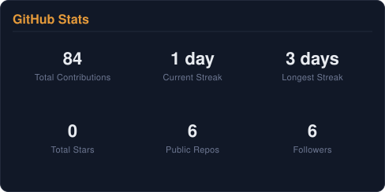
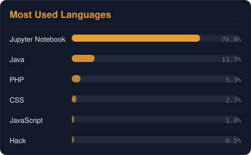

<p align="center">
  
</p>

<p align="center">
  
</p>

<p align="center">
  <a href="https://www.linkedin.com/in/mdsayed-hasan/">
    
  </a>
  <a href="mailto:blkeydsayed@gmail.com">
    
  </a>
  <a href="https://github.com/blkeyd">
    
  </a>
</p>

<p align="center">
  
</p>

<p align="center">
  
</p>

## 👋 About Me

I'm a **Computer Science & Engineering student** interested in building practical software at the intersection of **AI and software engineering**.

My experience ranges from **deep learning and computer vision** to **full-stack web development**, with a growing focus on turning AI research and ideas into usable applications.

I'm particularly interested in:

- 🤖 Artificial Intelligence & Machine Learning
- 👁️ Computer Vision & Deep Learning
- 🌐 Full-Stack Software Development
- 🧠 Vision-Language Models & Multimodal AI
- 🗣️ Bangla NLP
- ♿ AI for Assistive Technology
- 🔬 Applied AI Research

> **Currently:** Building, learning, experimenting, and working toward becoming an AI + Software Engineer.

<p align="center">
  
</p>

# 🚀 Selected Projects

<table>
<tr>
<td width="50%" valign="top">

### 🔥 Fire Detection with CNN & GAN
Deep learning project exploring image-based fire detection using **Convolutional Neural Networks and Generative Adversarial Networks**.

**Highlights**
- 🧠 CNN-based image classification
- 🔥 Fire / non-fire image recognition
- 🧬 GAN-based data generation and augmentation
- 📊 Model training and evaluation
- 🖼️ Image preprocessing and computer vision

`Python` `TensorFlow` `Keras` `PyTorch` `OpenCV` `CNN` `GAN`

**🔗 Repository:** 

</td>
<td width="50%" valign="top">

### 👤 DeepAttend — Face Recognition Attendance
Real-time face recognition attendance system designed to run on **ordinary classroom hardware without a dedicated GPU**.

**Highlights**
- 📷 Real-time webcam face detection
- 🧠 Deep-learning based face recognition
- 🔬 Experimented with AlexNet and transfer learning
- 👥 Supports multiple enrolled users
- 📝 Automatic attendance recording
- ⚡ Designed for CPU-based operation

`Python` `TensorFlow` `Keras` `OpenCV` `AlexNet` `Transfer Learning`

**🔗 Repository:** Coming soon

</td>
</tr>
<tr>
<td width="50%" valign="top">

### 🍕 PizzaGo — Restaurant Management System
Full-stack restaurant ordering and management platform built around the **MVC architecture**.

**Highlights**
- 👤 Customer, staff & admin roles
- 🔐 Authentication and authorization
- 🛒 Shopping cart and ordering
- 📦 Inventory management
- 📊 Order management
- 🗄️ Relational MySQL database

`PHP` `MySQL` `JavaScript` `HTML` `CSS` `Apache` `MVC`

**🔗 Repository:** Coming soon

</td>
<td width="50%" valign="top">

### 👁️ Bangla Vision-Language Model
*Research / Thesis*

Research exploring **vision-language models for Bangla assistive technology** — how multimodal AI can understand visual information and communicate it usefully in **Bangla**.

**Research areas**
- 👁️ Computer Vision
- 🧠 Vision-Language Models
- 🗣️ Bangla NLP
- ♿ Assistive Technology

`Python` `PyTorch` `Computer Vision` `NLP` `VLM`

**Status:** `Research / Thesis`

</td>
</tr>
</table>

### 🌐 Full-Stack Web Application
Currently developing a modern full-stack application using the **React ecosystem**.

<p align="center">
  
</p>

**Working with:** ⚛️ React · ▲ Next.js · 🟢 Node.js · 🎨 Tailwind CSS · 🔌 REST APIs · 🗄️ Backend & database integration

`Node.js` `React` `Next.js` `Tailwind CSS` `JavaScript` `REST APIs`

**Status:** `🚧 In Development` &nbsp;·&nbsp; **🔗 Repository:** Coming soon

<p align="center">
  
</p>

# 🧰 Tech Stack

### 💻 Languages
<p>
  
  
  
  
  
  
  
</p>

### 🤖 AI / Machine Learning
<p>
  
  
  
  
  
  
</p>

### 🌐 Web Development
<p>
  
  
  
  
  
  
</p>

### 🛠️ Tools & Platforms
<p>
  
  
  
  
  
  
  
</p>

<p align="center">
  
</p>

# 📊 GitHub Activity

These cards are generated by a GitHub Action (see `.github/workflows/stats.yml`) that pulls straight from the GitHub API and refreshes daily — no third-party rendering service, so they can't go down the way the old ones did.

<p align="center">
  
</p>

<p align="center">
  
</p>

<p align="center">
  
</p>

# 🎓 Education

**B.Sc. in Computer Science & Engineering**
American International University-Bangladesh — AIUB

Currently focused on:
`Software Engineering` · `Artificial Intelligence` · `Machine Learning` · `Computer Vision` · `Research`

<p align="center">
  
</p>

# 🔬 Research Interests

```text
Artificial Intelligence
       │
       ├── Machine Learning
       │      └── Deep Learning
       │
       ├── Computer Vision
       │      ├── Image Classification
       │      └── Vision-Language Models
       │
       ├── Natural Language Processing
       │      └── Bangla NLP
       │
       └── Assistive Technology
              └── Multimodal AI
```

<p align="center">
  
</p>

<p align="center">
  
</p>

<!--
Setup note (delete once done): the GitHub Activity cards above start as
placeholders. To generate them from live data, push this repo, then go to
Actions → "Update GitHub Stats" → "Run workflow" once. After that it
refreshes automatically every day — no tokens or external services needed,
it uses the built-in GITHUB_TOKEN.
-->
