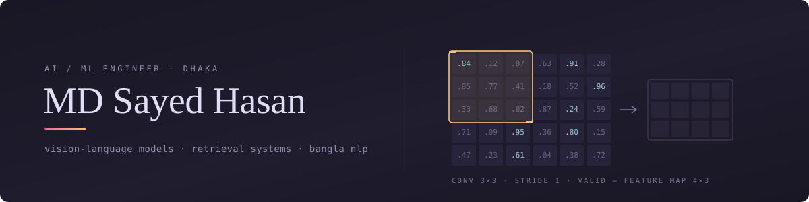

  

  

## About Me

I'm a Computer Science and Engineering student interested in building practical software with **AI, machine learning, computer vision, and modern web technologies**.

My work spans from developing full-stack applications to experimenting with deep learning models and computer vision systems. I'm particularly interested in how AI can be turned into useful, real-world products rather than staying purely theoretical.

Currently exploring **AI/ML, computer vision, full-stack development, and research-oriented projects**.

---

## Selected Work

### 🔥 Fire Detection with CNN & GAN

A deep learning project exploring fire detection using convolutional neural networks and generative adversarial networks.

* Built and trained deep learning models for image-based fire classification
* Explored GAN-based data generation and augmentation
* Worked with image datasets and model evaluation
* Focused on improving recognition of fire-related visual patterns

**Stack:** `Python` · `TensorFlow` · `Keras` · `PyTorch` · `OpenCV` · `GAN` · `CNN`

**Repo:** *Coming soon*

---

### 👤 Deep Learning Face Recognition & Attendance

A real-time face recognition attendance system designed to work with ordinary computer hardware.

* Implemented face detection and recognition using deep learning
* Experimented with **AlexNet** and transfer-learning approaches
* Built real-time webcam-based recognition
* Automatically records attendance based on recognized faces
* Designed to operate without requiring dedicated GPU hardware

**Stack:** `Python` · `TensorFlow` · `Keras` · `OpenCV` · `CNN` · `Transfer Learning`

**Repo:** *Coming soon*

---

### 🍕 PizzaGo

A full-stack restaurant ordering platform developed using the MVC architecture.

* Implemented customer, staff, and admin roles
* Built authentication, cart, ordering, and inventory functionality
* Designed a relational MySQL database
* Used MVC to separate application logic and improve maintainability
* Implemented server-side functionality with PHP and Apache

**Stack:** `PHP` · `MySQL` · `JavaScript` · `HTML` · `CSS` · `Apache` · `MVC`

**Repo:** *Coming soon*

---

### 🧑‍⚖️ Bangla Vision-Language Model — Research

Research-oriented work exploring **Bangla vision-language systems for assistive technology**.

The goal is to investigate how multimodal AI can understand visual environments and communicate useful information in Bangla, particularly for accessibility and assistive applications.

* Exploring computer vision + natural language processing
* Working with Bangla visual-language datasets
* Investigating vision-language models and multimodal AI
* Focus on practical assistive technology applications

**Stack:** `Python` · `PyTorch` · `Computer Vision` · `Deep Learning` · `NLP` · `Vision-Language Models`

**Status:** `Research / Thesis`

---

### 🌐 Full-Stack Web Application

Currently developing a modern full-stack application using the React ecosystem.

* Building a frontend with **React and Next.js**
* Styling with **Tailwind CSS**
* Developing backend functionality with **Node.js**
* Working with REST APIs and full-stack application architecture
* Exploring modern deployment and production development practices

**Stack:** `Node.js` · `React` · `Next.js` · `Tailwind CSS` · `JavaScript` · `REST APIs`

**Status:** `In Development`

**Repo:** *Coming soon*

---

## Tech Stack

### Languages

  
  
  
  
  
  
  

### AI / Machine Learning

  
  
  
  
  
  

### Web Development

  
  
  
  
  

### Tools & Platforms

  
  
  
  
  
  
  

<b>More</b>

 

| Area            | Technologies                                                  |
| --------------- | ------------------------------------------------------------- |
| **AI / ML**     | CNNs, GANs, Transfer Learning, Deep Learning, Computer Vision |
| **Data**        | NumPy, Pandas, Matplotlib, Jupyter                            |
| **NLP / AI**    | NLP, Hugging Face, Sentence Transformers                      |
| **Backend**     | Node.js, PHP, REST APIs                                       |
| **Frontend**    | React, Next.js, Tailwind CSS, HTML, CSS                       |
| **Databases**   | MySQL, SQL Server                                             |
| **Development** | MVC, AJAX, JSON, Git, GitHub                                  |
| **Environment** | Linux, Docker, Google Colab                                   |

---

## Education

**B.Sc. in Computer Science & Engineering**
American International University-Bangladesh (AIUB)

Currently focused on software engineering, artificial intelligence, machine learning, and research.

---

## Research Interests

* 🤖 Artificial Intelligence & Machine Learning
* 👁️ Computer Vision
* 🧠 Deep Learning
* 🌐 Vision-Language Models
* 🗣️ Bangla NLP & Multimodal AI
* ♿ AI for Assistive Technology
* 🔬 Applied AI Research

---

Building software, exploring AI, and turning ideas into working systems.

  

<a href="mailto:blkeydsayed@gmail.com">Get in touch →</a>

